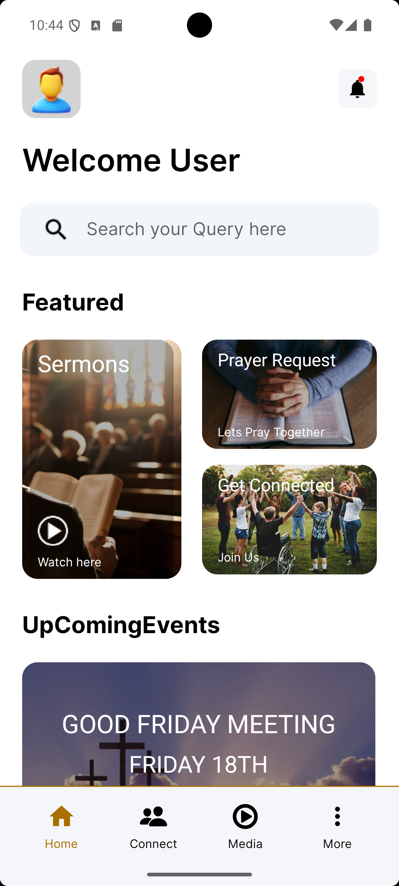
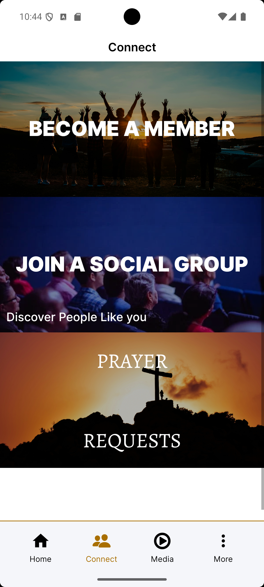
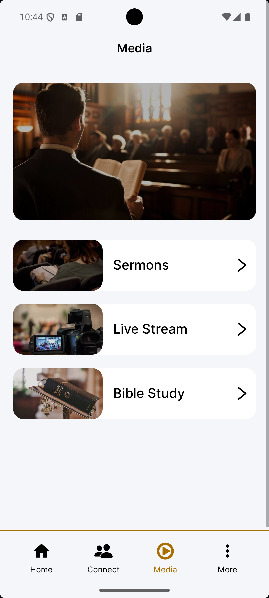
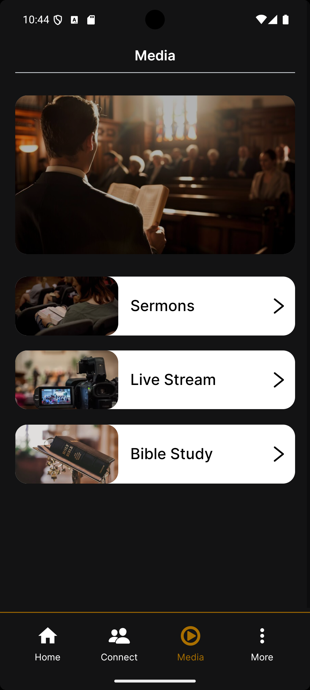
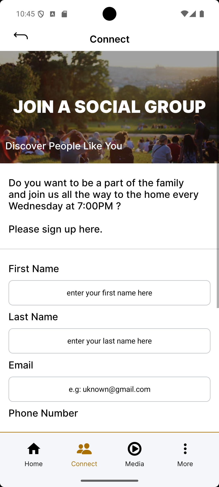
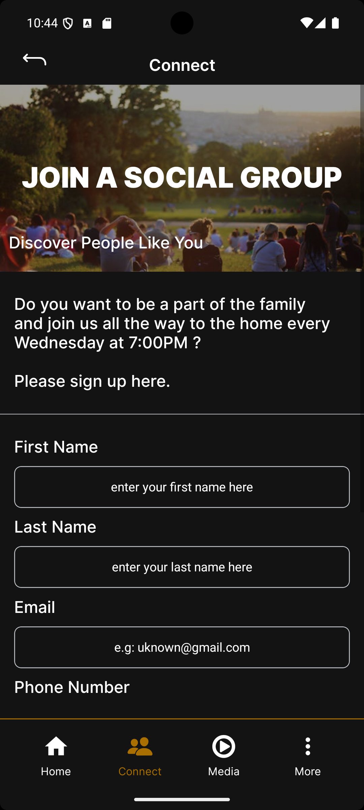
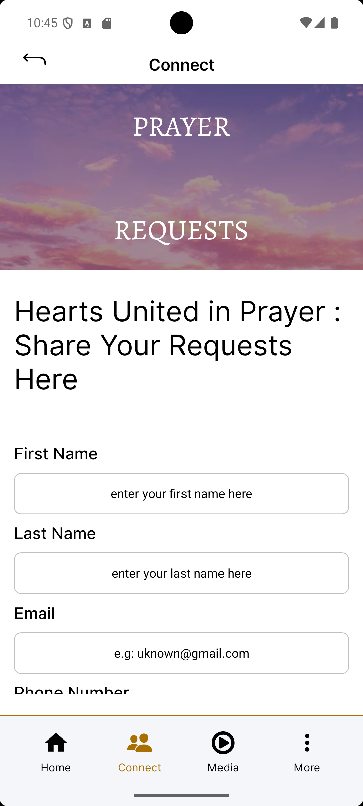
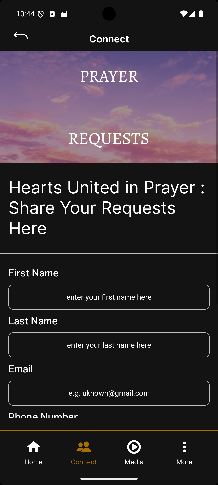
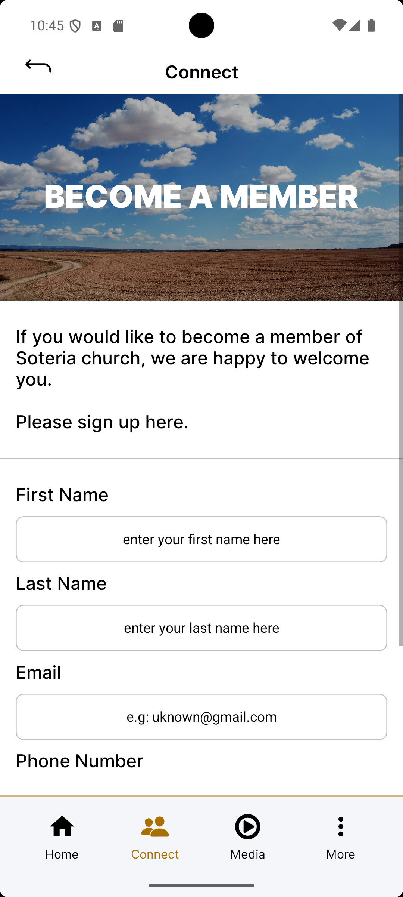
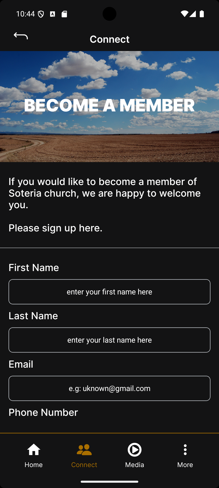

An enhanced, modern, and visually engaging church community app built with React Native. ChurchApp helps you connect with your community, participate in events, and grow in your faith—all in one place. This application is designed for my local church and is distributed via sideloading.

🚀 App Demo

Check out this quick demo of the app in action! Click the GIF to see the full 3 minute video with audio.

✨ Features

🏠 Multi-Screen Layout: Includes a Home Screen, Media Screen for sermons and videos, a Prayer Request section, and a Get Connected tab for community links. The app is designed to be expandable, so more screens can be added as needed.

🌙 Light & Dark Mode: Instantly switch between beautiful light and dark themes.

🧭 Smooth Navigation: Tab-based navigation with React Navigation for seamless movement across app sections.

🎨 Modern UI: A clean, church-inspired design with featured banners, cards, and inviting images.

🙏 Prayer Requests: Easily submit your prayer needs and join others in prayer.

🎥 Media Integration: Showcase sermons, videos, and featured church content.

🤝 Community Connection: Direct access to “Get Connected” resources for deeper involvement.

📱 Safe Area Support: Optimized layouts for all devices.

⚙️ Custom Theming: Built with an extendable theming system for future branding.

🗄 Backend Services

Supabase: Utilized as the primary backend platform for:

Storing user/member data

Handling prayer requests and community submissions

Providing real-time data and secure access

Cloudflare R2: Integrated for object storage, specifically for:

Uploading and streaming sermon videos

Storing links to media content, which are managed by Supabase

This combination allows for a cost-effective and scalable solution for data and media management.

🛠 Tech Stack & Key Dependencies

React Native (TypeScript): The core framework for building the app.

React Navigation: For smooth tab-based navigation.

Supabase: For backend services and database management.[1]

Cloudflare R2: For scalable, cost-effective object storage.[2][3]

Zustand: For state management.

React Native Vector Icons: For customizable icons.

React Native Video: For video playback.

React Native Image Picker: For selecting images.

ESLint & Prettier: For code quality and formatting.

📸 Screenshots
<table>
<tr>
<td align="center"></td>
<td align="center"></td>
</tr>
<tr>
<td align="center"><b>Home Screen</b></td>
<td align="center"><b>Connect Tab (Light)</b></td>
</tr>
<tr>
<td align="center"></td>
<td align="center"></td>
</tr>
<tr>
<td align="center"><b>Media Tab (Light)</b></td>
<td align="center"><b>Media Tab (Dark)</b></td>
</tr>
<tr>
<td align="center"></td>
<td align="center"></td>
</tr>
<tr>
<td align="center"><b>Social Tab (Light)</b></td>
<td align="center"><b>Social Tab (Dark)</b></td>
</tr>
<tr>
<td align="center"></td>
<td align="center"></td>
</tr>
<tr>
<td align="center"><b>Prayer Request (Light)</b></td>
<td align="center"><b>Prayer Request (Dark)</b></td>
</tr>
<tr>
<td align="center"></td>
<td align="center"></td>
</tr>
<tr>
<td align="center"><b>Become a Member (Light)</b></td>
<td align="center"><b>Become a Member (Dark)</b></td>
</tr>
</table>

ChurchApp is a work in progress. More features coming soon!

