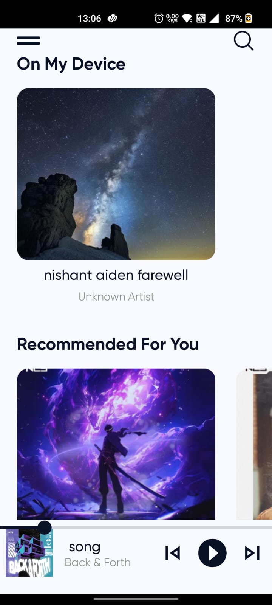
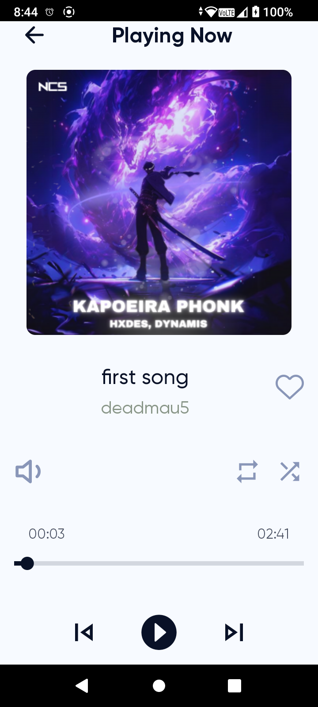
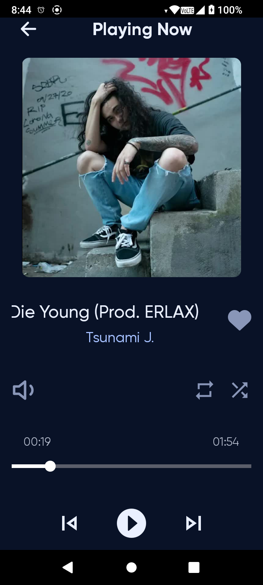
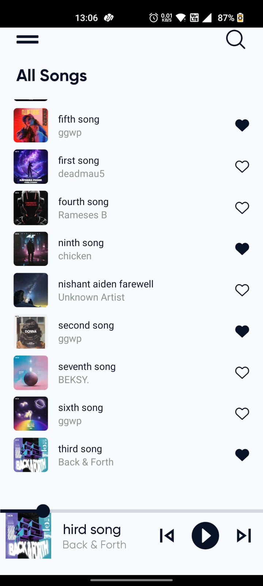
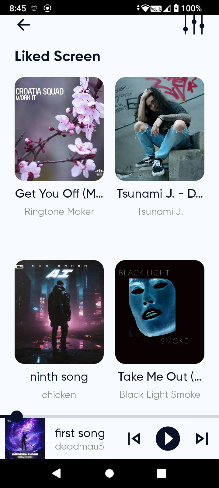
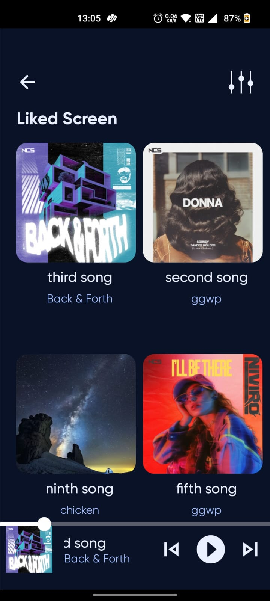
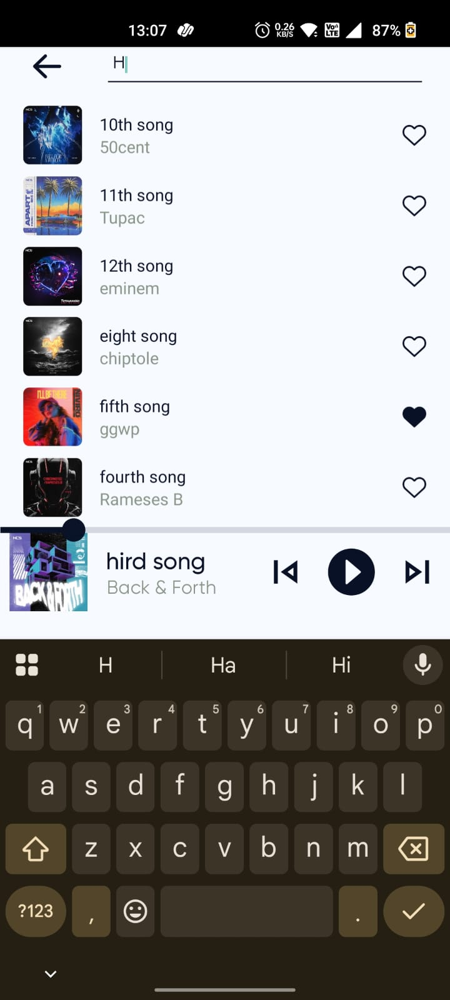
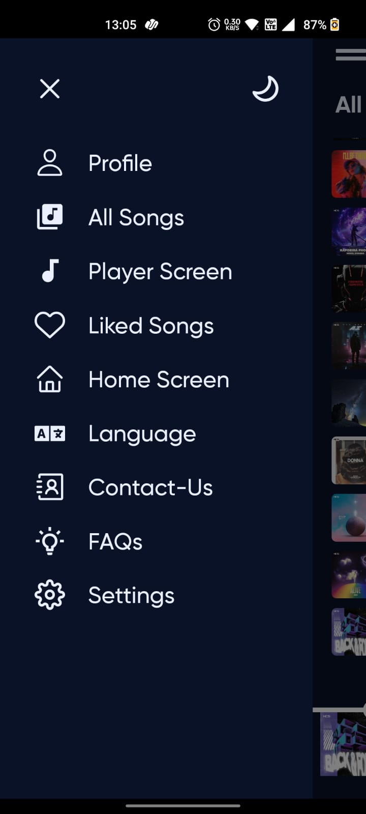

# 🎵 MusicPlayer App

A feature-rich **offline music player** built using **React Native**, offering smooth performance, a modern interface, and all essential playback controls — designed to run directly on your device.

---
## 🚀 App Demo

Check out this quick demo of the app in action! Click the GIF to see the full 4-minute video with audio.

## ✨ Features

- 🎧 **Multi-Screen Layout**
  - Home Screen
  - All Songs Screen
  - Liked Songs Screen
  - Player Screen

- 📂 **Automatic Music Detection**
  - Scans and lists audio files directly from your device storage

- ⚙️ **Global State Management**
  - Integrated **Zustand** for lightweight and scalable state handling

- 🧭 **Smooth Navigation**
  - Combines **Drawer** and **Stack Navigation** with `@react-navigation`

- ⏯ **Complete Audio Controls**
  - Play / Pause  
  - Skip to Next / Previous  
  - Shuffle Mode

- 🔎 **Search Functionality**
  - Intuitive search to find any song by title.

- 🖼 **Eye-Catching UI**
  - Built using two `FlatList` components for dynamic and scrollable sections

- 🌙 **Light & Dark Mode**
  - Toggle themes with a single button click

- 🖌 **Polished UX**
  - Custom App Icon  
  - Animated Splash Screen  

---

## 🛠 Tech Stack

- React Native
- Zustand
- React Navigation (Drawer + Stack)
- Metro Bundler
- TypeScript / JavaScript
- Android Native Modules (for file access)
- RNFS
- React Native Media Meta

---

## 📸 Screenshots

<table>
  <tr>
    <td align="center"></td>
    <td align="center"></td>
  </tr>
  <tr>
    <td align="center"><b>Home Screen (Light)</b></td>
    <td align="center"><b>Player Screen (Light)</b></td>
  </tr>
  <tr>
    <td align="center"></td>
    <td align="center"></td>
  </tr>
   <tr>
    <td align="center"><b>Player Screen (Dark)</b></td>
    <td align="center"><b>All Songs (Light)</b></td>
  </tr>
  <tr>
    <td align="center"></td>
    <td align="center"></td>
  </tr>
   <tr>
    <td align="center"><b>Liked Songs (Light)</b></td>
    <td align="center"><b>Liked Songs (Dark)</b></td>
  </tr>
  <tr>
    <td align="center"></td>
    <td align="center"></td>
  </tr>
   <tr>
    <td align="center"><b>Search Screen</b></td>
    <td align="center"><b>Drawer Menu (Dark)</b></td>
  </tr>
</table>